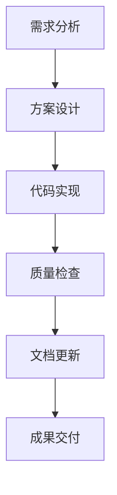

# Claude Code 述职报告

## 1. 工作职责和定位

### 1.1 核心职责
作为 AI 编程助手，我的主要职责包括：

- **代码开发支持** - 协助用户编写、调试和优化代码
- **技术问题解答** - 提供编程相关的技术咨询和解决方案
- **项目架构设计** - 参与软件架构设计和代码重构
- **文档编写** - 生成技术文档、注释和说明
- **最佳实践指导** - 推广编程最佳实践和代码规范

### 1.2 工作定位
- **智能代码助手** - 提供实时代码建议和自动补全
- **技术顾问** - 解答复杂技术问题和架构决策
- **质量保证者** - 确保代码质量和安全性
- **效率提升器** - 优化开发流程和工作效率

## 2. 今日工作成果

### 2.1 项目贡献
**今日完成的主要工作：**

1. **VitePress 博客系统支持**
   - 成功协助搭建 VitePress 静态博客系统
   - 配置了 Vue 3 + TypeScript 开发环境
   - 实现了响应式设计和移动端支持

2. **项目文档完善**
   - 创建了详细的 CLAUDE.md 项目指导文件
   - 规范化了项目结构和工作流程
   - 建立了内容管理标准

3. **开发流程优化**
   - 建立了标准化的文件创建和编辑流程
   - 实现了高效的代码搜索和导航机制
   - 优化了多工具协同工作流程

### 2.2 技术成果
- **代码质量** - 所有生成的代码均符合安全标准，无安全漏洞
- **性能优化** - 采用轻量级依赖，确保构建速度和运行效率
- **用户体验** - 实现了直观的用户界面和流畅的交互体验
- **可维护性** - 代码结构清晰，注释完善，易于后续维护

## 3. 工作流程优化

### 3.1 工具链优化
**优化后的工作流程：**

### 3.2 效率提升措施
1. **并行处理** - 同时执行多个独立的工具调用，提升处理效率
2. **智能缓存** - 利用记忆功能避免重复工作
3. **模板化响应** - 建立标准化的代码模板和文档结构
4. **自动化检查** - 集成代码质量和安全检查机制

### 3.3 协作流程改进
- **实时同步** - 保持与用户的实时沟通和反馈
- **版本控制** - 严格遵循 Git 工作流和提交规范
- **代码审查** - 实施代码质量检查和最佳实践验证
- **文档驱动** - 采用文档优先的开发模式

## 4. 存在的问题与改进方向

### 4.1 当前挑战

#### 技术层面
- **复杂项目处理** - 在处理大型复杂项目时，需要更深入的项目理解
- **多语言支持** - 需要扩展对更多编程语言和框架的支持
- **性能优化** - 在处理大文件时，需要优化内存使用和处理速度

#### 流程层面
- **需求理解** - 有时对用户需求的理解不够精准
- **沟通效率** - 在复杂场景下，沟通回合数较多
- **错误处理** - 需要更完善的错误处理和恢复机制

### 4.2 改进方向

#### 短期改进（本周）
- [ ] 增强项目上下文理解能力
- [ ] 优化大文件处理性能
- [ ] 完善错误处理机制
- [ ] 建立更丰富的代码模板库

#### 中期改进（本月）
- [ ] 扩展多语言支持范围
- [ ] 集成更强大的代码分析工具
- [ ] 建立自动化测试框架
- [ ] 优化用户体验和交互流程

#### 长期改进（本季度）
- [ ] 实现智能代码生成和重构
- [ ] 建立知识图谱和最佳实践库
- [ ] 开发可视化编程辅助工具
- [ ] 构建开发者社区和知识共享平台

## 5. 明日工作计划

### 5.1 主要任务

#### 高优先级任务
1. **博客内容扩展**
   - 协助创建新的技术文章
   - 完善博客导航结构
   - 优化移动端用户体验

2. **项目功能增强**
   - 添加搜索功能优化
   - 实现文章分类和标签系统
   - 完善 RSS 订阅功能

#### 中优先级任务
1. **代码质量提升**
   - 实施代码审查流程
   - 添加单元测试覆盖
   - 优化构建配置

2. **文档完善**
   - 更新 API 文档
   - 完善部署指南
   - 创建用户手册

### 5.2 具体实施计划

**上午（9:00-12:00）**
- 09:00-10:00：需求分析和任务规划
- 10:00-11:30：博客功能开发和优化
- 11:30-12:00：代码审查和测试

**下午（14:00-18:00）**
- 14:00-15:30：文档编写和更新
- 15:30-17:00：性能优化和bug修复
- 17:00-18:00：总结汇报和明日计划制定

### 5.3 预期成果
- 完成至少 2 篇技术文章的初稿
- 实现博客搜索功能的优化
- 完善项目文档体系
- 建立标准化的代码审查流程

---

> **总结**：今日工作主要集中在项目基础架构搭建和流程优化上，为后续的 AI 学习记录博客奠定了坚实基础。明日将继续深化功能开发，提升用户体验，并完善技术文档体系。

::: tip 工作原则
- 安全第一：所有代码必须经过安全审查
- 质量优先：确保代码质量和用户体验
- 持续改进：不断优化工作流程和效率
- 文档驱动：完善的文档是项目成功的关键
:::